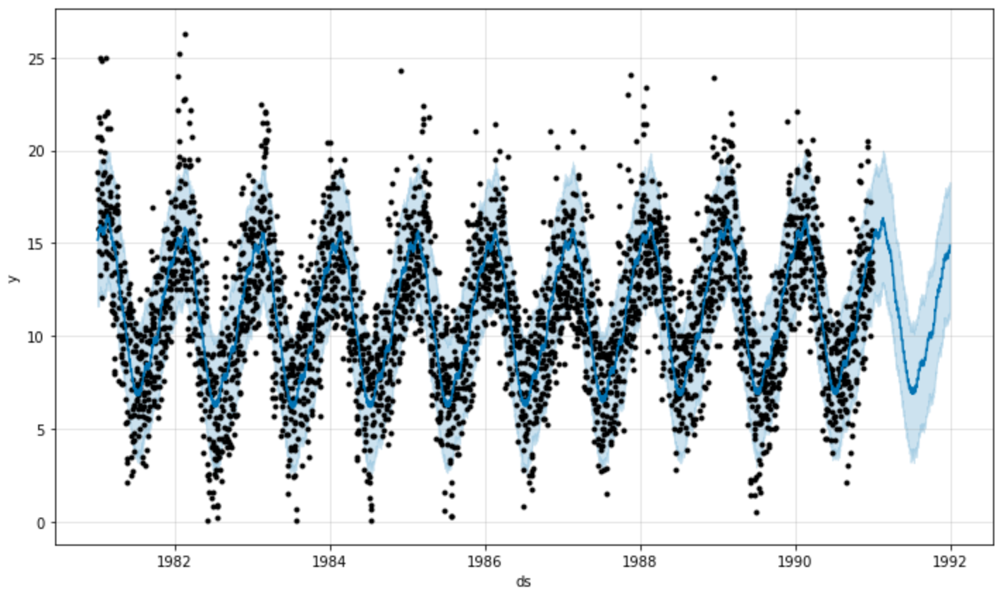
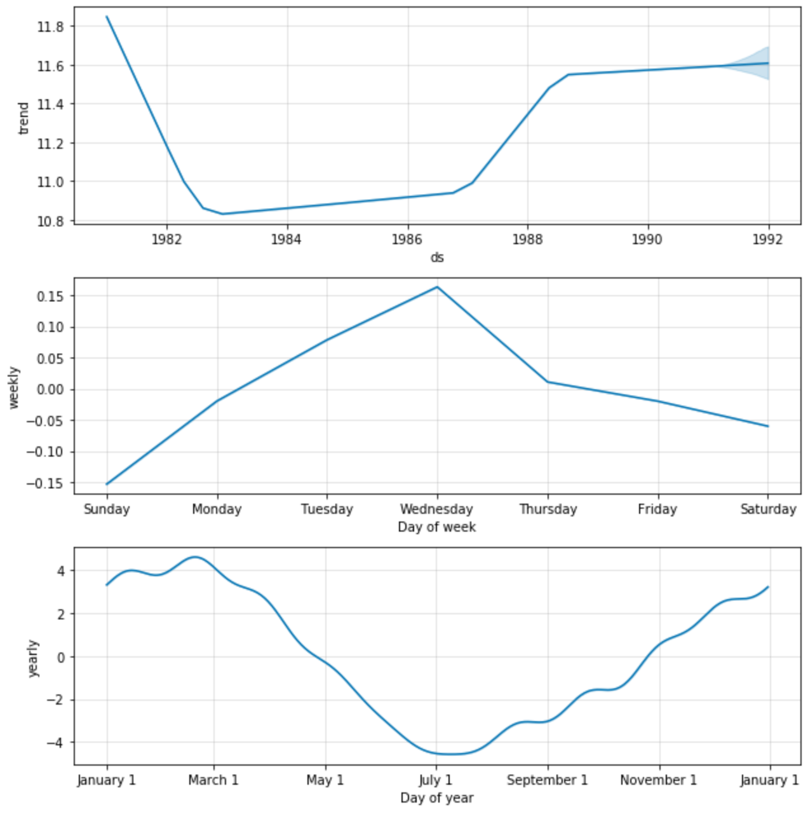

# Commodity Price Forecasting

Forecasting is such an essential part of business and everyday life. It is in your weather app and your business plan. I did some research and discovered that Facebook open sourced their time series forecasting model Prophet. [Read More](https://facebook.github.io/prophet/)

## Getting Started

* [Python 3.7](https://www.python.org/downloads/release/python-370/) - More info
* [prophet installation guide](https://facebook.github.io/prophet/docs/installation.html) - More Info 

### Libraries to install 

```
pip install -r requirements.txt
```

or pip install 
```
pandas
glob2
numpy
fbprophet
plotly
```
You might find that fbprohet does not install via pip then you can run a conda-forge:
```
conda install -c conda-forge fbprophet
```

### Download the data

* [Time Series Minimum Temp 1981-1991](https://www.kaggle.com/shenba/time-series-datasets)

### The Model

You can find the code in the model model.py file

#### Import the libraries and data

```Python
import pandas as pd
import glob2 as glob
import numpy as np
from fbprophet import Prophet
from fbprophet.plot import add_changepoints_to_plot
from fbprophet.plot import plot_plotly
import plotly.express as px
import plotly.offline as py
```

```Python
#####################################################################################################################################
### IMPORT DATA ###
#####################################################################################################################################
df = pd.read_csv('temp_data.csv')

#convert string to date format
df['Date'] = pd.to_datetime(df['Date'])
df['Daily minimum temperatures'] = df['Daily minimum temperatures'].map(lambda x: x.lstrip('?'))
df['Daily minimum temperatures'] = df['Daily minimum temperatures'].astype(float)

#####################################################################################################################################
### REVIEW THE TIMESERIES DATA ###
#####################################################################################################################################

#plot the daily minimum temperatures
fig = px.line(df, x='Date', y='Daily minimum temperatures')
fig.show()
```


#### Fit and Review Model

```Python
#####################################################################################################################################
### Fit the Model ###
#####################################################################################################################################

#format the data to required format for the library {Date: 'DS', Variable: 'Y'}
df = df.rename(columns={'Date':'ds', 'Daily minimum temperatures': 'y'})
forecast_training = df[['ds','y']]
forecast_training['y'] = np.where(
    forecast_training['y'] == 0, 0.1, forecast_training['y']
)

#fit model
m = Prophet()
m.fit(forecast_training)

#####################################################################################################################################
### Prediction incl. Parameters ###
#####################################################################################################################################

future = m.make_future_dataframe(periods=365)
future.tail() #tail end of the data

forecast = m.predict(future)
forecast[['ds', 'yhat', 'yhat_lower', 'yhat_upper']].tail()

#####################################################################################################################################
### REVIEW MODEL PERFORMANCE ###
#####################################################################################################################################

#plot the forecast
fig1 = m.plot(forecast)

#plot decomposition of seasonality and trends
fig2 = m.plot_components(forecast)

#Interactive plots
py.init_notebook_mode()

fig = plot_plotly(m, forecast)  # This returns a plotly Figure - interactive plot - use the date slider at the bottom
py.iplot(fig)
```




#### Run diagnostics on the first round model

```Python
#####################################################################################################################################
### RUN DIAGNOSTICS ###
#####################################################################################################################################

#run cross validation
from fbprophet.diagnostics import cross_validation
df_cv = cross_validation(m, initial='720 days', period='180 days', horizon = '180 days')
df_cv.head()

#plot cross validation absolute percent error for forecast
from fbprophet.plot import plot_cross_validation_metric
fig = plot_cross_validation_metric(df_cv, metric='mape')

```
#### Adjust seasonality and re-forecast

```Python
#####################################################################################################################################
### ADJUST & RE-FORECAST ###
#####################################################################################################################################

#Fourier Order for Seasonalities
from fbprophet.plot import plot_yearly
m = Prophet(yearly_seasonality=20).fit(forecast_training)
a = plot_yearly(m)

#Specifying Custom Seasonalities
m = Prophet(weekly_seasonality=False)
m.add_seasonality(name='monthly', period=30.5, fourier_order=20)
forecast = m.fit(forecast_training).predict(future)
fig = m.plot_components(forecast)
```


#### Final Forecast DataFrame

```Python
final_df = forecast[['ds','yhat','yhat_lower','yhat_upper']].rename(
    columns={'ds':'Date','yhat':'Daily minimum temperatures'}
)

#plot the daily minimum temperatures
import plotly.graph_objects as go

fig = go.Figure()
fig.add_trace(go.Scatter(x=final_df.Date, y=final_df['yhat_upper'], name="Upper",
                         line_color='deepskyblue'))

fig.add_trace(go.Scatter(x=final_df.Date, y=final_df['yhat_lower'], name="Lower",
                         line_color='dimgray'))

fig.add_trace(go.Scatter(x=final_df.Date, y=final_df['Daily minimum temperatures'], name="Daily minimum temperatures",
                         line_color='black'))

fig.update_layout(title_text='Daily minimum temperatures',
                  xaxis_rangeslider_visible=True)
fig.show()
```

## Author

* **Francois van Heerden** - *Experience* - [LinkedIn Profile](https://www.linkedin.com/in/francois-van-heerden-9589825a/)

## Acknowledgments

* Found inspiration from multiple fellow Data Scientists in the open source community